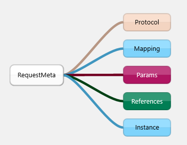
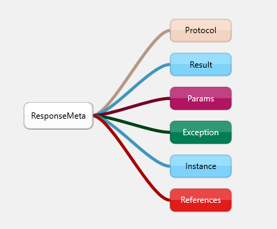

### 数据传输

- RequestMeta(请求元)

  

```json
{
	"protocol": "Sync-Request-1.0",
	"mapping": "User/addPack",
	"params": {
		"aPackage": {
			"instance": "mt.client.Package$$EnhancerByCGLIB$$7713a45b@35cabb2a",
			"nodes": {
				"User": "localhost:28017",
				"Server_1": "localhost:28003",
				"Server_2": "localhost:28003"
			}
		}
	},
	"references": {
		"1234": 1234,
		"mt.client.Package$$EnhancerByCGLIB$$7713a45b@69a2f3cc": {
			"name": "A背包"
		},
		"mt.client.User$$EnhancerByCGLIB$$713f5d40@534df152": {
			"password": "***",
			"apiToken": "1234",
			"packages": "[mt.client.Package$$EnhancerByCGLIB$$7713a45b@69a2f3cc, mt.client.Package$$EnhancerByCGLIB$$7713a45b@67651088]",
			"username": "m839336369"
		},
		"mt.client.Package$$EnhancerByCGLIB$$7713a45b@35cabb2a": {
			"name": "C背包"
		},
		"***": "***",
		"A背包": "A背包",
		"m839336369": "m839336369",
		"B背包": "B背包",
		"[mt.client.Package$$EnhancerByCGLIB$$7713a45b@69a2f3cc, mt.client.Package$$EnhancerByCGLIB$$7713a45b@67651088]": [{
			"instance": "mt.client.Package$$EnhancerByCGLIB$$7713a45b@69a2f3cc",
			"nodes": {
				"User": "localhost:28017",
				"Server_1": "localhost:28003",
				"Server_2": "localhost:28003"
			}
		}, {
			"instance": "mt.client.Package$$EnhancerByCGLIB$$7713a45b@67651088",
			"nodes": {
				"User": "localhost:28017",
				"Server_1": "localhost:28003",
				"Server_2": "localhost:28003"
			}
		}],
		"C背包": "C背包",
		"mt.client.Package$$EnhancerByCGLIB$$7713a45b@67651088": {
			"name": "B背包"
		}
	},
	"instance": {
		"instance": "mt.client.User$$EnhancerByCGLIB$$713f5d40@534df152",
		"nodes": {
			"User": "localhost:28017",
			"Server_1": "localhost:28003",
			"Server_2": "localhost:28003"
		}
	}
}
```

- ResponseMeta(返回元)

  

```json
{
	"protocol": "Sync-Response-1.0",
	"result": "true",
	"instance": {
		"instance": "mt.client.User$$EnhancerByCGLIB$$db49c047@8e0379d",
		"nodes": {
			"User": "localhost:28017",
			"Server_1": "localhost:28003",
			"Server_2": "localhost:28003"
		}
	},
	"params": {},
	"references": {
		"mt.client.User$$EnhancerByCGLIB$$db49c047@8e0379d": {
			"password": "***",
			"apiToken": "1234",
			"packages": "[mt.server.Package$$EnhancerByCGLIB$$20a58593@4018c77f, mt.server.Package$$EnhancerByCGLIB$$20a58593@44275ba4]",
			"username": "m839336369"
		},
		"1234": 1234,
		"mt.server.Package$$EnhancerByCGLIB$$20a58593@44275ba4": {
			"name": "B背包"
		},
		"true": true,
		"[mt.server.Package$$EnhancerByCGLIB$$20a58593@4018c77f, mt.server.Package$$EnhancerByCGLIB$$20a58593@44275ba4]": [{
			"instance": "mt.server.Package$$EnhancerByCGLIB$$20a58593@4018c77f",
			"nodes": {
				"User": "localhost:28017",
				"Server_1": "localhost:28003",
				"Server_2": "localhost:28003"
			}
		}, {
			"instance": "mt.server.Package$$EnhancerByCGLIB$$20a58593@44275ba4",
			"nodes": {
				"User": "localhost:28017",
				"Server_1": "localhost:28003",
				"Server_2": "localhost:28003"
			}
		}],
		"***": "***",
		"A背包": "A背包",
		"m839336369": "m839336369",
		"mt.server.Package$$EnhancerByCGLIB$$20a58593@4018c77f": {
			"name": "A背包"
		},
		"B背包": "B背包"
	}
}
```

- 采用了引用池的概念，避免了深拷贝问题。
- 网络传输分有两种类型实例，一种是节点实例，一种是普通实例，节点实例会附带Nodes节点信息
- 值得一提的是，在方法传参后，节点实例依旧保持着节点特性。